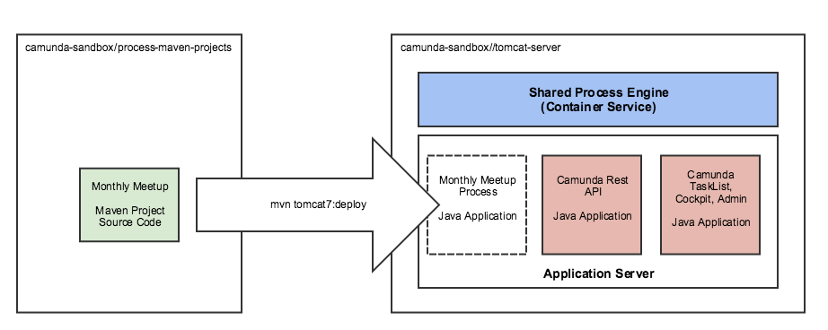
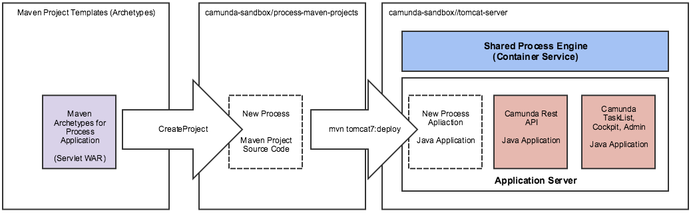
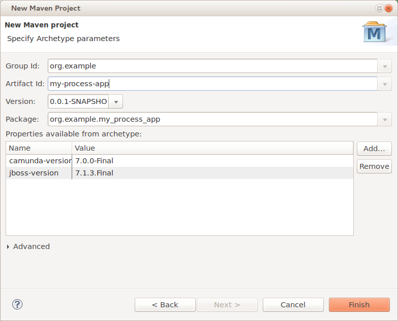

# Camunda-Lab-1

**Objective:** Create, build and deploy a new process application to a Tomcat Server setup with [Camunda shared-engine architecture](https://docs.camunda.org/manual/7.4/introduction/architecture/#shared-container-managed-process-engine)



# Run a Tomcat Server setup with Camunda shared-engine architecture

## Summary

1. Clone Lab and Setup

2. Run Tomcat Server

3. Verify Tomcat Server can accept Process Application Deployments

## Clone Lab and Setup

This project uses the variable $LAB_HOME to refer to the folder where you've cloned this repo.

```
export $LAB_HOME=/users/jrhicks/labs
```

Checkout this repo

```
cd $LAB_HOME
git clone https://github.com/jrhicks/camunda-lab-1.git
```

This lab requires [docker engine installation](https://docs.docker.com/engine/installation/).

## Run Tomcat Server

Docker is used to build a Tomcat server with system dependencies, some general camunda web applications, and configurations useful for this lab.

```
cd tomcat-server
docker build . -t camunda
docker run -p 8080:8080 camunda
```

## Verify Tomcat Server can accept Process Application Deployments (Using Docker)

Docker is not necessary to build and deploy a process application.  However, since the docker method is very reproducible it serves as a good mechanism to verify the Tomcat Server is setup correctly to accept deployments.

```
cd process-maven-projects/monthly-meetup

docker run -it --rm \
       -v "$(pwd)":/opt/maven \
       -w /opt/maven \
       --net="host" \
       maven:3.2-jdk-8 \
       mvn -s settings.xml clean tomcat7:deploy
```

Confirm Deployment by opening [http://localhost:8080](http://localhost:8080), create user, login, start process.

# Create, Build and Deploy an existing process application using Eclipse IDE

Ultimately we want to create our own process applications to deploy.  First we setup our Eclipse IDE and verify correct setup by deploying an existing process application.

## Summary

1. Install dependencies

2. Import existing project into Eclipse

3. Update user maven settings with Tomcat Server credentials

4. Create deploy & redeploy run configurations

5. Deploy

## Install dependencies

1. Install [Eclipse IDE For Java Developers - Neon1a](http://www.eclipse.org/downloads/packages/eclipse-ide-java-developers/neon1a)

2. Install [Java SE Development Kit 8](http://www.oracle.com/technetwork/java/javase/downloads/jdk8-downloads-2133151.html)

## Import existing project into Eclipse

1. Open Eclipse

2. File Menu -> Import -> Maven -> Existing Maven Projects -> Next

## Create deploy & redeploy run configurations

1. Run Menu -> Run Configurations

2. Right Click On Maven and select New

3. Configure a deploy build job

<table><tr><td>

</td><td valign="top">
<ol>
<li> Name the run Configuration
<li> Click Filesystem and select folder $LABS_HOME/camunda_lab_1/process-maven-projects/monthly-meetup
<li> Set Goals to: tomcat7:deploy
<li> Note the path of user settings.  In later steps we will refer to this as $USER_SETTINGS_PATH
<li> Apply
<li> Close
</td></tr></table>

4. Configure a redeploy build job.  Repeat previous steps to create a run configuration except name it redeploy and set the goal to: tomcat7:redeploy.

## Update user maven settings

Copy user_settings.xml into $USER_SETTINGS_PATH

```
export $USER_SETTINGS_PATH=~/.m2/user_settings.xml
```

```
cp $LABS_HOME/camunda_lab_1/process-maven-projects/monthly-meetup/settings.xml $USER_SETTINGS_PATH
```

## Deploy

* Run Build -> Depending on situation either deploy or redeploy.

# Create, Build and Deploy a new process application



Camunda provides [Maven Project Templates (Archetypes)](https://docs.camunda.org/manual/7.4/user-guide/process-applications/maven-archetypes/) to enable a quick start to developing process applications.

## Summary

1. Add Camunda Project Template Catalog to Eclipse

2. Create a Process Application Using Template

3. Edit Process using Camunda Modeler

4. Build & Deploy

## Add Camunda Project Template Catalog to Eclipse

1. Go to **Preferences -> Maven -> Archetypes -> Add Remote Catalog**


2. Enter the following URL and description, click on **Verify...** to test the connection and if that worked click on **OK** to save the catalog.

    Catalog File: **https://app.camunda.com/nexus/content/repositories/camunda-bpm/**

    Description: **camunda BPM platform**


## Create a Process Application Using Template

Now you should be able to use the archetypes when creating a new Maven project in Eclipse:

1. Go to **File -> New -> Project...** and select **Maven -> Maven Project**


2. Select a location for the project or just keep the default setting.

3. Select the archetype from the catalog that you created before.


4. Specify Maven coordinates and Camunda version and finish the project creation.

