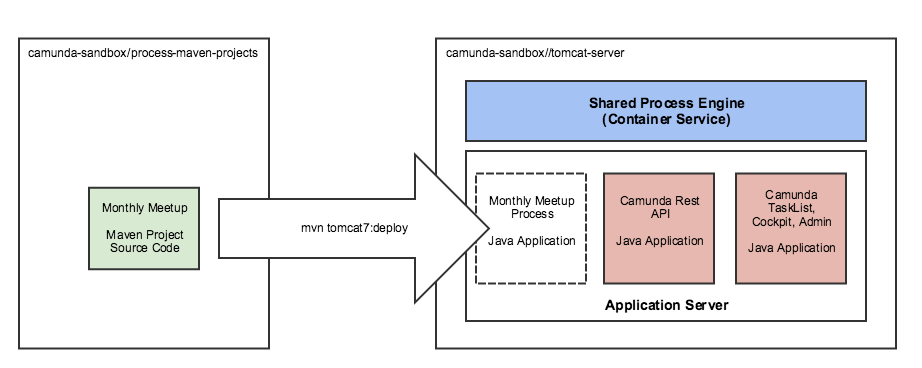

# Camunda Shared Engine and Process Application Deployment Lab



## Goal

1) Run a Tomcat server which is setup for the [Camunda shared-engine architecture](https://docs.camunda.org/manual/7.4/introduction/architecture/#shared-container-managed-process-engine)

2) Build and deploy a process application from the [Maven Archetypes for Process Application (Servlet WAR)](https://docs.camunda.org/manual/7.4/user-guide/process-applications/maven-archetypes/)

3) Setup a development environment in Eclipse for building and deploying proces applications.

4) Create

## Run Tomcat Server

Docker is used to build a Tomcat server with system dependencies, general camunda web applications, and configurations useful for this lab.

```
cd tomcat-server
docker build . -t camunda
docker run -p 8080:8080 camunda
```

## Build & Deploy Process Application (Docker Option)

Build and Deploy

```
cd process-maven-projects/monthly-meetup

docker run -it --rm \
       -v "$(pwd)":/opt/maven \
       -w /opt/maven \
       --net="host" \
       maven:3.2-jdk-8 \
       mvn -s settings.xml clean tomcat7:deploy
```

Confirm Deployment by opening [http://localhost:8080](http://localhost:8080), create user, login, start process.

## Build & Deploy Process Application (Eclipse Option)

* Install [Eclipse IDE For Java Developers - Neon1a](http://www.eclipse.org/downloads/packages/eclipse-ide-java-developers/neon1a)

* Install Java 8

* .... to be continued
